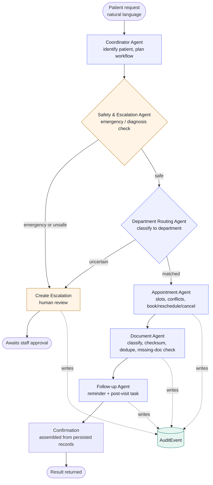
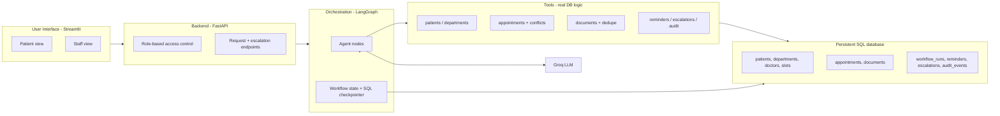
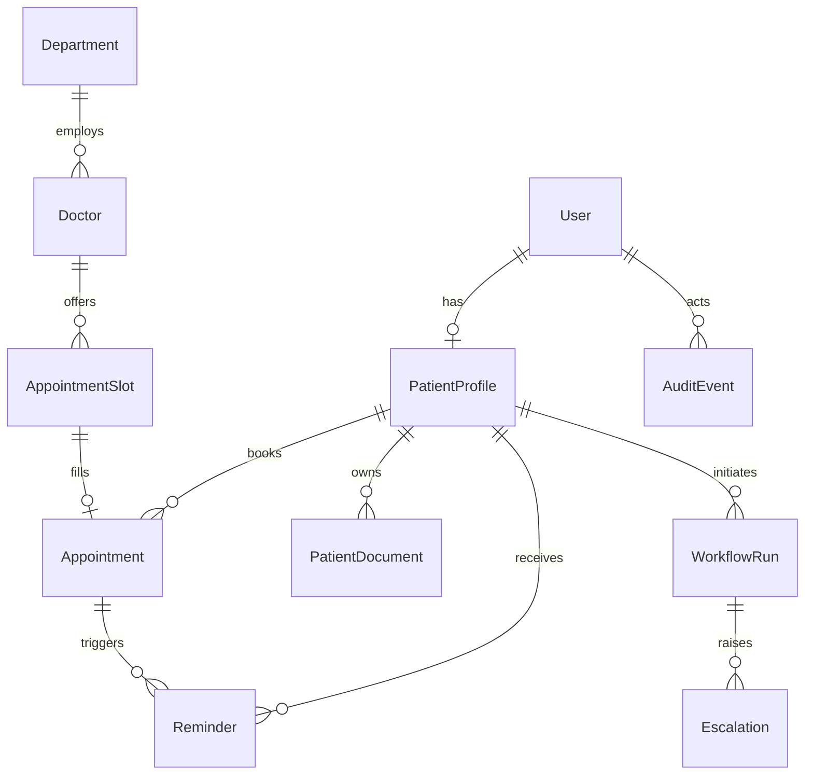

# AgentCare — Agentic AI for Patient Administration & Care Coordination

An agentic healthcare **administration** system that coordinates a patient's
non-clinical journey — registration → department routing → appointment booking →
document coordination → confirmation & reminders → follow-up — while keeping all
medical decisions under human supervision.

> **Safety boundary:** AgentCare performs administration and coordination only.
> It never diagnoses conditions, prescribes medicine, recommends dosages, or
> claims to replace a clinician. Emergency or clinical requests are escalated to
> a human.

**AgentCare Build Challenge 2026 submission.**

---

## Architecture

> Diagrams render on GitHub natively and in VS Code with the
> **Markdown Preview Mermaid Support** extension.

### Agent orchestration flow



### Layered system architecture



### Agents (each with its own prompt + responsibility/tools)
| Agent | Responsibility |
|-------|----------------|
| **Coordinator** | Understands the goal, sequences agents, tracks completion |
| **Safety & Escalation** | Blocks diagnosis/prescription, escalates emergencies |
| **Department Routing** | Classifies request, maps to a department, handles uncertainty |
| **Appointment** | Slots, conflict checks, book / reschedule / cancel, persists |
| **Document** | Classify, checksum, dedupe, patient-mapping, missing-doc checks |
| **Follow-up** | Reminders and post-visit follow-up tasks |

> Full architecture write-up — agent distinctness, state handoff, safety, and tools — is in **[ARCHITECTURE.md](ARCHITECTURE.md)**.

### Data model (entity relationships)



---

## Tech stack
- **Orchestration:** LangGraph (stateful graph, SQL checkpointer)
- **LLM:** Groq (`llama-3.3-70b-versatile`, free tier)
- **Backend:** FastAPI (role-based access enforced server-side)
- **Database:** SQLAlchemy → SQLite (dev) / PostgreSQL (prod)
- **UI:** Streamlit (patient / staff / admin — role-aware app shell)

---

### Roles
| Role | Can do |
|------|--------|
| **Patient** | Self-register, submit requests, upload documents, view own appointments / documents / reminders / escalations |
| **Staff** | Review & approve/reject escalations, inspect workflows + agent state, view audit trail |
| **Admin** | All staff actions + list/create accounts (People) and view departments |

All role permissions are enforced in the backend (FastAPI dependencies), not by hiding UI.

## Setup

### 1. Clone & create a virtual environment
```bash
git clone <your-repo-url>
cd agentcare
python -m venv .venv
source .venv/bin/activate        # Windows: .venv\Scripts\activate
```

### 2. Install dependencies
```bash
pip install -r requirements.txt
```

### 3. Configure environment
```bash
cp .env.example .env
# Edit .env and add your GROQ_API_KEY (free at https://console.groq.com)
```

### 4. Initialize and seed the database
```bash
python init_db.py     # create all tables
python seed.py        # load synthetic departments, doctors, slots, demo users
```

### 5. Run tests
```bash
pytest -q
```

### Demo logins (synthetic)
| Role | Email | Password |
|------|-------|----------|
| Admin | admin@agentcare.local | admin123 |
| Staff | staff@agentcare.local | staff123 |
| Patient | patient@agentcare.local | patient123 |

*(Backend / UI run commands are added on Day 4–5.)*

---

## Project structure
```
agentcare/
├── app/
│   ├── config.py        # environment-based configuration
│   ├── database.py      # SQLAlchemy engine + session
│   ├── models.py        # all ORM models (persistent SQL schema)
│   ├── security.py      # password hashing
│   ├── tools/           # agent tools (Day 2)
│   ├── agents/          # LangGraph agents + graph (Day 3)
│   ├── api/             # FastAPI backend + RBAC (Day 4)
│   └── ui/              # Streamlit app-shell UI (patient/staff/admin)
├── tests/               # pytest suite
├── init_db.py           # create tables
├── seed.py              # synthetic seed data
├── requirements.txt
├── .env.example         # config template (no secrets)
└── .github/workflows/   # CI checks
```

---

## Tools (Day 2 — all real DB logic, no stubs)

Every tool performs genuine logic against the persistent database and writes an
audit event. None return fixed responses.

| Tool | What it really does |
|------|---------------------|
| `find_or_create_patient` | Resolves a patient by email or creates User + PatientProfile |
| `lookup_department` | Exact then fuzzy match against the persisted department list; returns candidates when uncertain |
| `get_available_slots` | Queries OPEN slots joined to doctor + department |
| `book_appointment` | **Genuine conflict detection** — slot must be OPEN and patient must have no overlapping active appointment |
| `reschedule_appointment` | Frees the old slot, conflict-checks and books the new one |
| `cancel_appointment` | Cancels and frees the slot |
| `classify_and_store_document` | Keyword classification + **SHA-256 checksum duplicate detection** + real file storage |
| `check_missing_documents` | Compares a patient's docs against the department's required set |
| `create_reminder` / `create_followup` | Persisted reminder / post-visit follow-up tasks |
| `create_escalation` | Human-in-the-loop record; marks the workflow escalated |
| `write_audit` | Append-only audit trail written by every tool |

Run the tool tests:
```bash
pytest tests/test_tools.py -v
```

## Running the agent workflow (Day 3)

The six agents are wired into a LangGraph graph with conditional edges
(emergency / diagnosis-seeking -> escalate; uncertain route -> escalate) and a
SQL checkpointer. Workflow state is persisted to `WorkflowRun` **and**
checkpointed, so it survives restarts and is inspectable by staff.

**Run it offline (no API key needed) to verify the wiring:**
```bash
AGENTCARE_FAKE_LLM=1 python run_workflow.py
```
This deterministic mode lets the graph run end to end without a network call.

**Run it with the real LLM:**
```bash
# put GROQ_API_KEY in .env, then:
python run_workflow.py
```

**What the demo shows:**
- a normal request -> routed, booked, documents coordinated, reminders set, confirmed
- an emergency ("chest pain") -> Safety agent escalates, **no booking**
- a diagnosis-seeking request -> Safety agent escalates as sensitive

Run the agent tests:
```bash
pytest tests/test_agents.py -v
```

## Backend API (Day 4)

FastAPI backend with **role-based access enforced server-side** (not by hiding UI),
JWT auth, the escalation-approval workflow, and audit endpoints.

**Run the API:**
```bash
uvicorn app.api.main:app --reload
# interactive docs at http://127.0.0.1:8000/docs
```

**Key endpoints**

| Method | Path | Role | Purpose |
|--------|------|------|---------|
| POST | `/auth/login` | any | email + password -> JWT |
| POST | `/auth/register` | public | patient self-registration -> JWT |
| POST | `/requests` | patient+ | submit request -> runs the agent workflow |
| GET | `/me/appointments` `/me/documents` `/me/reminders` `/me/escalations` | patient | view OWN data only |
| POST | `/me/documents/upload` | patient | multipart file upload -> classify + dedupe |
| GET | `/me/available-slots` | patient | open slots for one of your appointments |
| POST | `/me/appointments/{id}/reschedule` | patient | reschedule your OWN appointment (ownership enforced) |
| POST | `/me/appointments/{id}/cancel` | patient | cancel your OWN appointment (ownership enforced) |
| GET | `/staff/escalations` | staff | list escalations |
| POST | `/staff/escalations/{id}/review` | staff | approve/reject (persisted, audited) |
| GET | `/staff/workflows` `/staff/workflows/{id}` | staff | inspect runs + persisted agent state |
| GET | `/staff/audit` | staff | the audit trail |
| GET | `/staff/departments` | staff | department + doctor counts |
| GET | `/admin/users` | admin | list all accounts (filter by role) |
| POST | `/admin/users` | admin | create a staff or patient account |

RBAC is enforced in FastAPI dependencies across three roles (patient / staff /
admin): a patient token calling a `/staff/*` or `/admin/*` endpoint gets **403**,
a staff token calling `/admin/*` gets **403**, and missing tokens get **401** —
all verified by tests.

Run the API tests:
```bash
pytest tests/test_api.py -v
```

## User interface (Day 5)

A polished **Streamlit** app wired entirely to the FastAPI backend over HTTP —
every value shown comes from a live API call (`app/ui/api_client.py`). The layout
is a three-region app shell: a role-aware sidebar (navigation + account), the main
content area, and a contextual right panel (guidance, legends, the safety boundary
reminder). Colors come from `.streamlit/config.toml` (native theme) plus a scoped
CSS design system, so it renders reliably across Streamlit versions.

**Three role-aware experiences**

- **Patient** — sign in *or self-register*; submit an administrative request (runs
  the agent workflow) and see the confirmation/escalation with the agent trace;
  upload documents; and view own requests, appointments, documents, reminders, and
  escalations.
- **Staff** — review open escalations (approve/reject, persisted + audited),
  inspect workflow runs and the persisted agent-state snapshot, and browse the
  audit trail.
- **Admin** — everything staff can do, plus **People**: list all accounts and
  create new staff or patient users, and view departments.

**Run it (two terminals):**
```bash
# Terminal 1 — backend
uvicorn app.api.main:app --reload

# Terminal 2 — UI (from the project root)
streamlit run app/ui/streamlit_app.py
```
Point the UI at a non-default backend with `AGENTCARE_API_BASE`.

The UI's data layer is unit-tested against the live backend, proving the interface
is genuinely wired (not displaying hardcoded data):
```bash
pytest tests/test_ui_client.py tests/test_accounts.py tests/test_edge_cases.py -v
```

### Troubleshooting login (401)
`401 Unauthorized` on login almost always means the API and `seed.py` used
**different database files** (the `sqlite:///./data/...` path is relative to the
launch directory). Run both `uvicorn` and `python seed.py` from the **project
root**. A `diagnose.py` helper prints the resolved DB path and whether the demo
logins authenticate.

## Data & secret safety
- No real patient data — all seed data is synthetic.
- Secrets live only in a local, gitignored `.env`; `.env.example` ships without values.
- Passwords are bcrypt-hashed; never stored in plaintext.

---

## Status
- [x] **Day 1** — project scaffold, full SQL schema, seed data, tests, config
- [x] **Day 2** — tools layer (10 DB-backed functions, all tested)
- [x] **Day 3** — LangGraph agents + orchestration (6 agents, conditional escalation, SQL checkpointer, 15 tests)
- [x] **Day 4** — FastAPI backend + backend-enforced RBAC + escalation approval + audit API (7 API tests)
- [x] **Day 5** — Streamlit UI (patient / staff / admin, self-registration, admin user management), wired to the backend
- [x] **Day 6** — hardening: reschedule/cancel endpoints with backend ownership enforcement, duplicate-doc + double-cancel edge cases, interactive appointment management in the UI
- [x] **Day 7** — safety false-positive fix, lifespan migration, empty-request guard, past-slot protection, full appointment lifecycle (confirmed -> awaiting confirmation -> completed/missed) with staff outcome recording and distinct status colors — staff upcoming-schedule view, **52 tests passing**